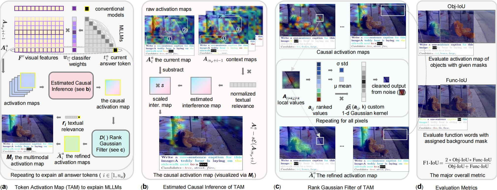
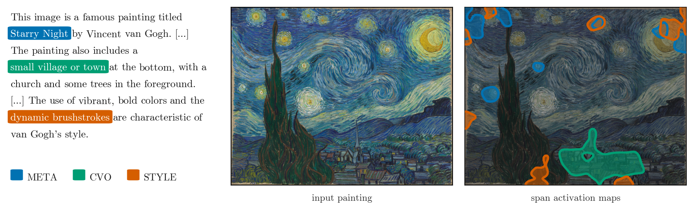
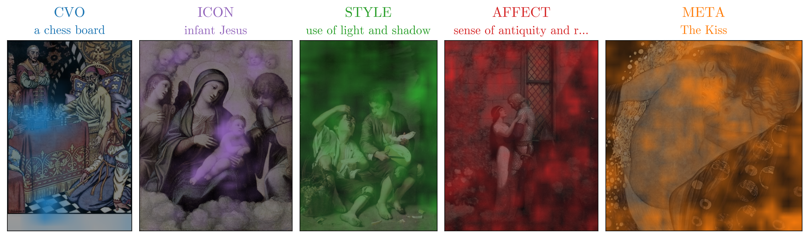
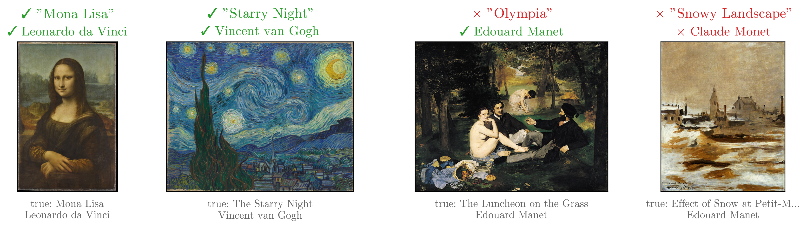
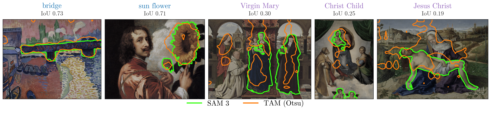

# Understanding How MLLMs Describe Artworks Using Token Activation Maps

This is the official code repository for the paper **"Understanding How MLLMs
Describe Artworks Using Token Activation Maps."**

> 📝 **Status: under review.**

We use **Token Activation Maps (TAM)** ([ICCV 2025 Oral](https://arxiv.org/abs/2506.23270))
— a method that visualizes the image evidence behind *every word* a Multimodal
LLM generates — to study how an MLLM (Qwen2-VL) describes paintings. For each
caption we localize the visual support of every span, classify spans into
art-description categories, and analyze *where the model looks* when it names
objects, iconographic subjects, styles, and metadata.



The TAM algorithm itself is packaged as `tamart.tam`, exposing a single
high-level entry point — the `TAMExplainer` class. Everything else in `tamart`
builds the painting dataset and the three experiments on top of it.

<p align="center">
  <br>
  <em>Per-span TAM maps for a caption of <b>The Starry Night</b>: a concrete
  object (<code>small village or town</code>) localizes to one region, while
  metadata and style spans scatter across the canvas.</em>
</p>

---

## Table of contents

- [Installation](#installation)
- [Hugging Face cache (`HF_HOME`)](#hugging-face-cache-hf_home)
- [Reproducing the experiments](#reproducing-the-experiments)
  - [Step 0 — Download the WikiArt dataset](#step-0--download-the-wikiart-dataset)
  - [Step 1 — Describe](#step-1--describe)
  - [Step 2 — Classify](#step-2--classify)
  - [Step 3 — Validate metadata](#step-3--validate-metadata)
  - [Step 4 — Segment with SAM 3](#step-4--segment-with-sam-3)
  - [Analysis notebooks & figures](#analysis-notebooks--figures)
- [Running on SLURM](#running-on-slurm)
- [Using TAM directly](#using-tam-directly)
- [Repository layout](#repository-layout)
- [Citation](#citation)
- [License](#license)

---

## Installation

The project is managed with [**uv**](https://docs.astral.sh/uv/). With uv
installed:

```bash
git clone https://github.com/nicolafan/tamart.git
cd tamart
uv sync
```

`uv sync` creates a `.venv` (Python 3.13) and installs everything pinned in
`uv.lock`, including the CUDA build of PyTorch, a prebuilt `flash-attn` wheel,
and `vllm`. Run any command either inside the env (`source .venv/bin/activate`)
or with the `uv run` prefix used throughout this README.

> ⚙️ **Hardware.** The `flash-attn` / `vllm` stack is **Linux + NVIDIA GPU
> only**. All experiments were run on a single **A100 (40/80 GB)**.

Optional — TAM's LaTeX-rendered text visualization needs XeTeX:

```bash
sudo apt-get install texlive-xetex
```

### Second environment for SAM 3 (segmentation only)

The segmentation experiment uses Meta's **SAM 3** (`facebook/sam3`), which
requires `transformers>=5`. That conflicts with the main env, where
`transformers` is pinned `<5` by `vllm`. The two cannot coexist, so SAM 3 lives
in a **separate** `.venv-sam3`:

```bash
uv venv .venv-sam3 --python 3.13
uv pip install --python .venv-sam3 \
  --extra-index-url https://download.pytorch.org/whl/cu126 \
  torch==2.9.1 torchvision==0.24.1 "transformers>=5.5,<6" \
  accelerate pillow numpy safetensors python-dotenv tqdm click
# put tamart on its path without pulling the vllm stack:
uv pip install --python .venv-sam3 --no-deps -e .
```

You only need this env for [Step 4](#step-4--segment-with-sam-3).

---

## Hugging Face cache (`HF_HOME`)

Importing `tamart` automatically points `HF_HOME` at `data/hf/` under the repo
root, so all model weights land in one place regardless of where you launch
scripts from. The default lives in `.env`:

```
HF_HOME=data/hf
```

Relative paths are resolved against the repo root and `~` is expanded. `.env`
**overrides** any shell-level `HF_HOME` — edit it to relocate the cache.

> **Notebooks:** keep `import tamart` at the very top, *before* any
> `import transformers` / `from huggingface_hub import ...`, since HF libraries
> read `HF_HOME` at their own import time.

---

## Reproducing the experiments

The full pipeline is a chain — each stage writes a per-painting subfolder that
the next stage (and the analysis notebooks) read back:

```
download ─► describe ─► classify ─┬─► validate_meta   (Experiment 2 data)
                                  └─► segment          (Experiment 3 data)

Experiment 1 reads describe + classify directly.
```

Every stage is **resumable** (re-running skips paintings already done) and has a
ready-made SLURM script in [`launches/`](launches/) — see
[Running on SLURM](#running-on-slurm). The commands below show how to run each
stage **locally** with `uv run`.

### Step 0 — Download the WikiArt dataset

Pulls the ranked **top-1000 most-viewed paintings** from the WikiArt v2 JSON
API and downloads each painting's metadata and image at the highest resolution
available.

```bash
uv run python -m tamart.data.download data/datasets/wikiart_most_viewed -n 1000
```

Output layout:

```
data/datasets/wikiart_most_viewed/
  images/0001_<slug>.jpg, 0002_<slug>.jpg, ...   # ranked, highest res available
  annotations.json                                # ordered metadata (title, artist, year, styles, ...)
```

`annotations.json` is rewritten incrementally, so a crash mid-run loses no
progress; re-running skips images already on disk (`--overwrite` forces a
re-download).

### Step 1 — Describe

For every painting, run **Qwen2-VL** with a single "describe the content and
style" prompt and save the caption, the per-token TAM activation maps, and the
processed image.

```bash
uv run python -m tamart.experiments.describe --batch-size 4
# override defaults:
uv run python -m tamart.experiments.describe --model-name Qwen/Qwen2-VL-7B-Instruct --max-new-tokens 256
```

Output (one subfolder per painting):

```
describe/<image_stem>/
  answer.json        # text, token ids, token_labels, per-token img/txt stats
  maps.safetensors   # one float32 TAM map per generated token, keyed by token index
  proc_img.png       # the processed RGB image TAM overlays maps onto
```

### Step 2 — Classify

Feed each caption (as a numbered token list) to a text-only instruct LLM
(`Qwen/Qwen3-4B-Instruct-2507`) and label each meaningful span with one of:

| Category   | Meaning                                                              |
|------------|---------------------------------------------------------------------|
| `CVO`      | Concrete visual object with a physical location in the image        |
| `ICON`     | Named iconographic subject (mythological / religious / historical)  |
| `STYLE`    | Painterly or formal attribute (brushwork, palette, technique)       |
| `SPATIAL`  | Compositional / relational descriptor (background, left side)       |
| `AFFECT`   | Affective or interpretive claim (dramatic atmosphere, serene)       |
| `META`     | Artist name, painting title, or provenance metadata                 |

```bash
uv run python -m tamart.experiments.classify
```

The token indices in the output stay aligned with `token_labels` from `describe`,
so every span maps straight onto its TAM maps.

```
classify/<image_stem>/
  classification.json  # list of {tokens: [indices], word, category} spans
  raw_response.txt     # raw model output (kept for debugging parse failures)
```

### Step 3 — Validate metadata

> **Experiment 2 — does the model recognize the artwork?**

Take the `META` spans from `classify`, extract a single title/artist prediction
per painting with an instruct LLM, then grade it against the WikiArt ground
truth (LLM-as-a-judge, matching by meaning).

```bash
uv run python -m tamart.experiments.validate_meta --batch-size 256
```

```
validate_meta/<image_stem>/
  validation.json   # title/artist predictions + correctness verdicts
```

### Step 4 — Segment with SAM 3

> **Experiment 3 — TAM saliency vs. an open-vocabulary segmenter.**

Take the `CVO` and `ICON` spans and, using each span's surface word as a concept
prompt, segment the painting with **SAM 3**. The union of instance masks per
expression is a pseudo-ground-truth "where is this concept" mask, computed on the
*same processed canvas* as the TAM maps so they compare pixel-for-pixel.

This stage runs in the **`.venv-sam3`** environment. `facebook/sam3` is gated, and
importing `tamart` repoints `HF_HOME` away from your default token location, so
expose your Hugging Face token explicitly:

```bash
export HF_TOKEN=$(cat ~/.cache/huggingface/token)
.venv-sam3/bin/python -m tamart.experiments.segment
# smoke test on 2 paintings:
.venv-sam3/bin/python -m tamart.experiments.segment --limit 2
```

```
segment/<image_stem>/
  masks.safetensors   # one uint8 {0,1} union mask per CVO/ICON span, key = span index
  segments.json       # per-span metadata: tokens, word, category, scores, boxes, area
```

### Analysis notebooks & figures

With the pipeline complete, the three experiments are analyzed in
[`notebooks/`](notebooks/). Each notebook is self-contained — it reads the
precomputed per-painting outputs (no model reload) and ends with a **Paper
outputs** section that writes vector figures to [`notebooks/figs/`](notebooks/figs/).

| Notebook | Experiment |
|----------|------------|
| [`notebooks/exp1.ipynb`](notebooks/exp1.ipynb) | **Exp 1** — spatial entropy of TAM maps by span category |
| [`notebooks/exp2.ipynb`](notebooks/exp2.ipynb) | **Exp 2** — do TAM statistics predict metadata correctness? |
| [`notebooks/exp3.ipynb`](notebooks/exp3.ipynb) | **Exp 3** — TAM saliency vs. SAM 3 concept masks (IoU) |
| [`notebooks/viz.ipynb`](notebooks/viz.ipynb)   | Interactive viewer + the per-span teaser figure |

Open each one in Jupyter or VS Code (kernel = the project `.venv`) and **Run
All** — every figure is rewritten into `notebooks/figs/` as it runs.

> The qualitative example strips (`*_examples.pdf`) are exported from an
> `ipywidgets` picker, so run those cells **interactively** — a headless
> `nbconvert --execute` will stall on the widgets. The statistical plots are
> regenerated unconditionally.

**Experiment 1** — TAM maps localize sharply for concrete objects and diffuse for
style/metadata spans:

<p align="center">
  <br>
  <em>One example activation map per span category (sharpest → most diffuse).</em>
</p>

**Experiment 2** — the model is far better at naming the artist than the exact
title:

<p align="center">
  
</p>

**Experiment 3** — TAM maps agree with SAM 3 concept masks but are coarser:

<p align="center">
  <br>
  <em>TAM prediction (orange) vs. SAM 3 mask (green) per CVO/ICON span.</em>
</p>

---

## Running on SLURM

Every heavy stage has a batch script under [`launches/`](launches/), preconfigured
for a single A100. Submit them in pipeline order:

```bash
sbatch launches/describe.sh
sbatch launches/classify.sh
sbatch launches/validate_meta.sh
sbatch launches/segment.sh        # uses .venv-sam3 + exports HF_TOKEN
```

Logs are written to `out/`. Adjust the `#SBATCH` directives (partition, account,
`module load` lines) to match your cluster.

---

## Using TAM directly

The TAM explainer can be used standalone on any image:

```python
from tamart.tam import TAMExplainer

explainer = TAMExplainer(model_name="Qwen/Qwen2-VL-2B-Instruct")

result = explainer.explain("imgs/demo.jpg", "Describe this image.")
print(result["text"])        # generated answer
print(len(result["maps"]))   # one TAM activation map per generated token

# save TAM visualizations as JPGs:
explainer.explain("imgs/demo.jpg", "Describe this image.", save_dir="out/")
```

The result dict holds `text` (str), `maps` (list of `np.ndarray`, one per token),
and `tokens` (generated token ids). Currently only **Qwen2-VL** (any size) is
wired into `TAMExplainer`. To wire up another MLLM, the raw `TAM` function is
exposed via `from tamart.tam import TAM` — see
[`src/tamart/tam/core.py`](src/tamart/tam/core.py) and
[`src/tamart/tam/explainer.py`](src/tamart/tam/explainer.py).

See also the standalone examples:

```bash
uv run python examples/demo.py                                        # qualitative demo
uv run python examples/eval.py Qwen/Qwen2-VL-2B-Instruct data/coco2014  # quantitative eval
```

---

## Repository layout

```
src/tamart/
  tam/            — the TAM algorithm + TAMExplainer (Qwen2-VL wrapper) and metrics
  data/           — WikiArt download (download.py) and annotation utilities
  experiments/
    describe.py       — caption every painting, save TAM maps for notebook replay
    classify.py       — group description tokens into art-description categories
    validate_meta.py  — extract & grade title/artist predictions (Exp 2)
    segment.py        — SAM 3 concept masks for CVO/ICON spans (Exp 3, .venv-sam3)
notebooks/        — exp1 / exp2 / exp3 analyses + viz; figures in figs/
launches/         — SLURM batch scripts, one per stage
examples/         — standalone TAM demo & eval scripts
```

---

## Citation

If you use this code, please cite our paper (citation to be updated upon
publication):

```bibtex
@misc{tamart,
  title  = {Understanding How MLLMs Describe Artworks Using Token Activation Maps},
  note   = {Under review},
  year   = {2026}
}
```

This work builds on Token Activation Maps:

```bibtex
@InProceedings{Li_2025_ICCV,
    author    = {Li, Yi and Wang, Hualiang and Ding, Xinpeng and Wang, Haonan and Li, Xiaomeng},
    title     = {Token Activation Map to Visually Explain Multimodal LLMs},
    booktitle = {Proceedings of the IEEE/CVF International Conference on Computer Vision (ICCV)},
    month     = {October},
    year      = {2025},
    pages     = {48-58}
}
```

## License

MIT.
